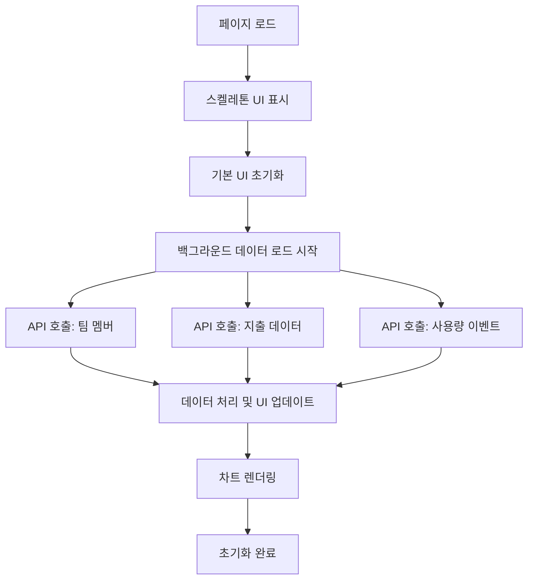
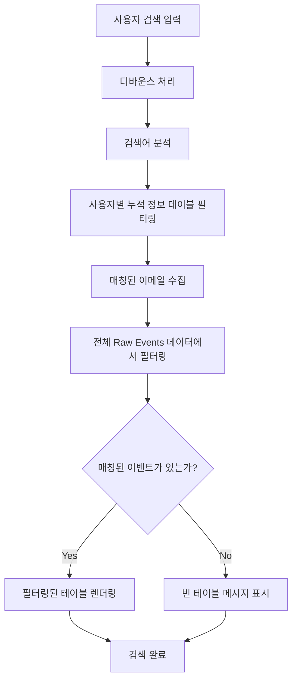
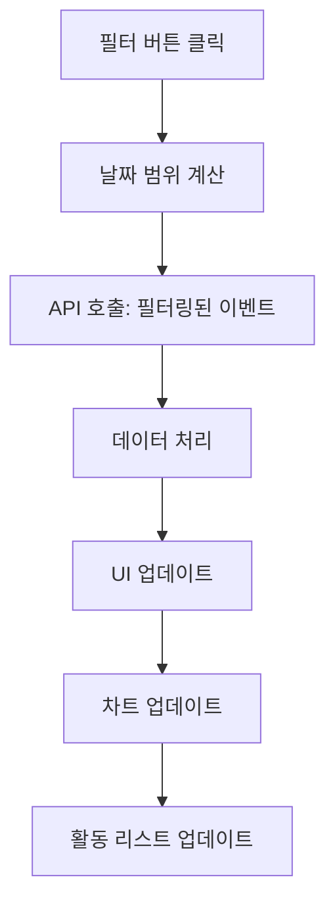
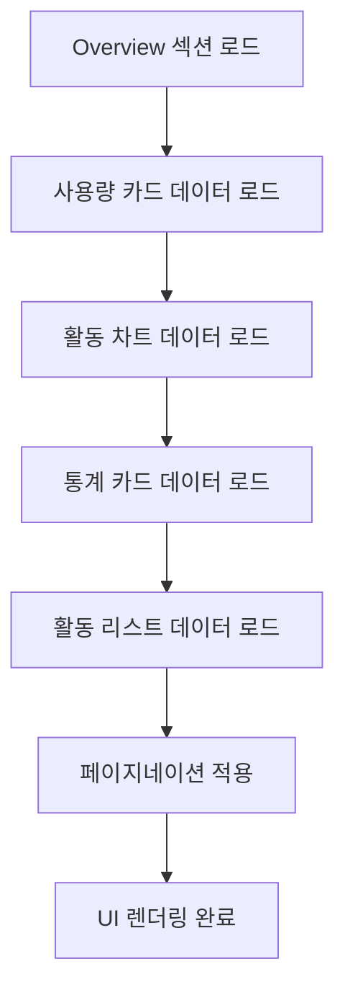

# Samsung AI Experience Group Dashboard - 기술 문서

## 목차
1. [시스템 아키텍처](#1-시스템-아키텍처)
2. [API 구조](#2-api-구조)
3. [프론트엔드 컴포넌트](#3-프론트엔드-컴포넌트)
4. [데이터 플로우](#4-데이터-플로우)
5. [성능 최적화](#5-성능-최적화)
6. [보안 고려사항](#6-보안-고려사항)
7. [개발 가이드](#7-개발-가이드)

## 1. 시스템 아키텍처

### 1.1 전체 구조

```
┌─────────────────┐    ┌─────────────────┐    ┌─────────────────┐
│   Web Browser   │    │  Proxy Server   │    │  Cursor Admin   │
│                 │◄──►│  (localhost:8001)│◄──►│      API       │
│   Dashboard     │    │                 │    │                 │
└─────────────────┘    └─────────────────┘    └─────────────────┘
```

### 1.2 기술 스택

**프론트엔드**
- HTML5 + CSS3 + Vanilla JavaScript
- 다크 테마 UI/UX
- 반응형 디자인
- Canvas API (차트 렌더링)

**백엔드 통신**
- Fetch API (RESTful)
- Basic Authentication
- JSON 데이터 형식

**데이터 처리**
- 클라이언트 사이드 필터링
- 페이지네이션
- 실시간 검색

### 1.3 파일 구조

```
dashboard/
├── dash.html              # 메인 대시보드 파일
├── proxy_server.py        # 프록시 서버
├── cursor_teams_api.py    # API 클라이언트
├── requirements.txt       # Python 의존성
├── user_manual_doc.md    # 사용자 매뉴얼
├── technical_documentation.md # 기술 문서
└── README.md             # 프로젝트 개요
```

## 2. API 구조

### 2.1 API 엔드포인트

**기본 설정**
```javascript
const API_CONFIG = {
    baseUrl: 'http://localhost:8001', // 포트 변경
    apiKey: 'key_e46368ce482125bbd568b7d55090c657e30e4b73c824f522cbc9ef9b1bf3f0d3',
    headers: {
        'Content-Type': 'application/json'
    }
};
```

**주요 엔드포인트**

| 엔드포인트 | 메서드 | 설명 | 응답 형식 |
|-----------|--------|------|-----------|
| `/teams/members` | GET | 팀 멤버 목록 조회 | `{teamMembers: [...]}` |
| `/teams/spend` | POST | 팀 지출 데이터 조회 | `{teamMemberSpend: [...]}` |
| `/teams/daily-usage-data` | POST | 일별 사용량 데이터 | `{data: [...]}` |
| `/teams/filtered-usage-events` | POST | 필터링된 이벤트 조회 | `{usageEvents: [...]}` |

### 2.2 인증 방식

**Basic Authentication**
```javascript
const credentials = `${API_CONFIG.apiKey}:`;
const encodedCredentials = btoa(credentials);
const authHeader = `Basic ${encodedCredentials}`;
```

### 2.3 데이터 모델

**팀 멤버 (Team Member)**
```javascript
{
    name: string,           // 멤버 이름
    email: string,          // 이메일 주소
    role: string           // 역할 (owner/member)
}
```

**지출 데이터 (Spend Data)**
```javascript
{
    email: string,                    // 이메일
    fastPremiumRequests: number,      // 프리미엄 요청 수
    spendCents: number,              // 지출 (센트)
    hardLimitOverrideDollars: number // 하드 리미트 오버라이드
}
```

**사용량 이벤트 (Usage Event)**
```javascript
{
    timestamp: string,        // 타임스탬프
    userEmail: string,       // 사용자 이메일
    kindLabel: string,       // 이벤트 유형
    requestsCosts: number,   // 요청 비용
    model: string,          // 사용 모델
    maxMode: boolean        // 최대 모드 사용 여부
}
```

## 3. 프론트엔드 컴포넌트

### 3.1 메인 레이아웃

**HTML 구조**
```html
<div class="dashboard-container">
    <nav class="sidebar">          <!-- 좌측 네비게이션 -->
    <main class="main-content">    <!-- 메인 콘텐츠 영역 -->
        <header class="header">    <!-- 상단 헤더 -->
        <div class="content-area"> <!-- 콘텐츠 영역 -->
```

**CSS Grid 시스템**
```css
.dashboard-container {
    display: flex;
    height: 100vh;
}

.sidebar {
    width: 250px;
    flex-shrink: 0;
}

.main-content {
    flex: 1;
    display: flex;
    flex-direction: column;
}
```

### 3.2 섹션별 컴포넌트

#### 3.2.1 Overview 섹션 ⭐ **UPDATED**

**사용량 개요 카드 (Usage Cards)**
```javascript
// Overview 섹션 상단에 추가된 사용량 카드
const usageCards = [
    { label: 'Total Users', value: 17 },
    { label: 'Lines of Agent Edits', value: 290172 },
    { label: 'Tabs Accepted', value: 25 },
    { label: 'Chats', value: 1294 }
];
```

**활동 차트 (Activity Chart) - 개선된 데이터**
```javascript
// 실제 사용자 활동 데이터 기반 차트
function createOverviewChart() {
    const canvas = document.getElementById('overviewChart');
    const ctx = canvas.getContext('2d');
    
    // 실제 데이터 패턴: 7월 22일부터 활동 시작
    // 7월 23일과 28일에 피크(10명), 이후 점진적 감소
    const chartData = [
        { date: 'Jul 05', users: 0 },
        { date: 'Jul 22', users: 6 },
        { date: 'Jul 23', users: 10 },
        { date: 'Jul 24', users: 6 },
        { date: 'Jul 25', users: 7 },
        { date: 'Jul 26', users: 1 },
        { date: 'Jul 27', users: 6 },
        { date: 'Jul 28', users: 10 },
        { date: 'Jul 29', users: 5 },
        { date: 'Jul 30', users: 5 },
        { date: 'Jul 31', users: 5 },
        { date: 'Aug 01', users: 4 },
        { date: 'Aug 02', users: 3 }
    ];
}
```

**통계 카드 (Statistics Cards)**
```javascript
// 카드 데이터 구조
const statCards = [
    { type: 'total', number: 20, label: '전체 멤버', description: '모든 멤버의 활동 기록' },
    { type: 'active', number: 13, label: '활성 멤버', description: '활성 멤버의 활동 기록' },
    { type: 'inactive', number: 7, label: '비활성 멤버', description: '비활성 멤버의 활동 기록' }
];
```

**활동 리스트 페이지네이션 (Overview Activity List)**
```javascript
// Overview 활동 리스트에 페이지네이션 추가
function renderOverviewActivityTableWithPagination(activities) {
    const totalActivities = activities.length;
    const totalPages = Math.ceil(totalActivities / currentActivityPageSize);
    const startIndex = (currentActivityPage - 1) * currentActivityPageSize;
    const endIndex = Math.min(startIndex + currentActivityPageSize, totalActivities);
    
    // 페이지네이션 헤더 업데이트
    const headerElement = document.querySelector('.overview-activity-header');
    headerElement.innerHTML = `
        <span>📋 활동 리스트 (${startIndex + 1}-${endIndex} of ${totalActivities})</span>
        <select id="overviewActivityPageSize" onchange="changeOverviewActivityPageSize(this.value)">
            <option value="10">10개 보기</option>
            <option value="20">20개 보기</option>
            <option value="30">30개 보기</option>
            <option value="50">50개 보기</option>
            <option value="100">100개 보기</option>
        </select>
    `;
}
```

**실시간 데이터 새로고침**
```javascript
// 사이드바에 추가된 새로고침 버튼
function handleRefreshClick() {
    // 진행 상황 표시
    const progressBar = document.querySelector('.refresh-progress-bar');
    progressBar.style.width = '0%';
    document.querySelector('.refresh-progress').style.display = 'block';
    
    // 데이터 새로고침
    refreshAllRealData().then(() => {
        progressBar.style.width = '100%';
        setTimeout(() => {
            document.querySelector('.refresh-progress').style.display = 'none';
        }, 1000);
    });
}
```

#### 3.2.2 Members 섹션

**Fast Requests 정보 표시**
```javascript
// Members 섹션 상단에 Fast Requests 리셋 정보 추가
function updateFastRequestsResetDate(teamMemberSpend) {
    const resetDate = '2025년 7월 22일';
    const resetDateElement = document.getElementById('fast-requests-reset-date');
    if (resetDateElement) {
        resetDateElement.textContent = resetDate;
    }
    
    // 한국 시간 기준 오늘 날짜 업데이트
    updateTodayDate();
}
```

**멤버 테이블 업데이트**
```javascript
// 멤버 테이블을 실제 API 데이터로 업데이트
async function updateMembersWithRealData() {
    try {
        // 1. 실제 팀원 정보 가져오기
        const membersData = await getTeamMembers();
        
        // 2. 실제 지출 데이터 가져오기
        const spendingData = await getTeamSpendingData();
        
        // 3. 이메일 기준으로 멤버와 지출 데이터 매핑
        const memberSpendMap = {};
        spendingData.teamMemberSpend.forEach(spendInfo => {
            memberSpendMap[spendInfo.email] = {
                premiumRequests: spendInfo.fastPremiumRequests || 0,
                spend: (spendInfo.spendCents || 0) / 100,
                hardLimitOverride: spendInfo.hardLimitOverrideDollars || 0
            };
        });
        
        // 4. Fast Requests 리셋 날짜 표시
        updateFastRequestsResetDate(spendingData.teamMemberSpend);
        
        // 5. 멤버 테이블 업데이트
        updateMembersTable(membersData.teamMembers, memberSpendMap);
    } catch (error) {
        console.error('❌ 실제 API 데이터 로드 실패:', error);
    }
}
```

#### 3.2.3 Usage 섹션

**연동 검색 시스템**
```javascript
function filterUsageMembers(searchTerm) {
    // 1. 사용자별 누적 사용량 정보 테이블 필터링
    const matchedEmails = new Set();
    
    // 2. All Raw Events 테이블 연동 필터링
    if (matchedEmails.size > 0) {
        const filteredEvents = currentRawEventsData.filter(event => {
            // 정확한 이메일 매칭 로직
            return Array.from(matchedEmails).some(email => {
                const emailLower = email.toLowerCase().trim();
                const eventEmailLower = eventUserEmail.toLowerCase().trim();
                return emailLower === eventEmailLower;
            });
        });
        
        renderFilteredRawEventsTable(filteredEvents, container);
    }
}
```

**페이지네이션 시스템**

**All Raw Events 스타일 페이지네이션**
```javascript
// 사용자별 누적 사용량 정보 테이블
function renderUserCumulativeTableWithPagination(userInfos, startDate, endDate) {
    // 상단 드롭박스 + 하단 숫자 페이지네이션
    // All Raw Events와 동일한 스타일
}

// 페이지네이션 생성 함수
function generateUserCumulativePagination(totalPages) {
    // 숫자 페이지 버튼 (1, 2, 3, ...)
    // 이전/다음 버튼
    // "..." 표시 (건너뛴 페이지)
}
```

**API 페이지네이션 처리**
```javascript
// 모든 페이지 데이터 수집
async function getFilteredEvents(startDate, endDate) {
    let allEvents = [];
    let currentPage = 1;
    let hasMorePages = true;
    
    while (hasMorePages) {
        const pageData = await callAPI('/teams/filtered-usage-events', 'POST', {
            startDate: startDate,
            endDate: endDate,
            page: currentPage,
            pageSize: 1000
        });
        
        if (pageData && pageData.usageEvents) {
            allEvents = allEvents.concat(pageData.usageEvents);
            hasMorePages = pageData.pagination && pageData.pagination.hasNextPage;
            currentPage++;
        }
    }
    
    return {
        totalUsageEventsCount: allEvents.length,
        usageEvents: allEvents,
        period: { startDate, endDate }
    };
}
```

**REQUEST 칼럼 계산 로직**
```javascript
// 사용자별 누적 사용량 정보의 REQUEST 칼럼
// All Raw Events의 COST값(requestsCosts) 누적
eventsData.usageEvents.forEach(event => {
    const requestCost = event.requestsCosts || 0;
    userPeriodStats[userEmail].periodRequests += requestCost;
});
```
```javascript
function renderRawEventsTableWithPagination() {
    const totalEvents = currentRawEventsData.length;
    const totalPages = Math.ceil(totalEvents / currentRawEventsPageSize);
    const startIndex = (currentRawEventsPage - 1) * currentRawEventsPageSize;
    const endIndex = Math.min(startIndex + currentRawEventsPageSize, totalEvents);
    const pageEvents = currentRawEventsData.slice(startIndex, endIndex);
}
```

### 3.3 상태 관리

**전역 변수**
```javascript
let currentFilterType = 'total';           // 현재 필터 타입
let currentActivities = [];               // 현재 활동 데이터
let currentMembers = [];                  // 현재 멤버 데이터
let currentDateRange = null;              // 현재 날짜 범위 (Overview)
let currentUsageDateRange = null;         // 현재 날짜 범위 (Usage)
let currentRawEventsData = [];            // 현재 Raw Events 전체 데이터
let currentRawEventsPage = 1;             // 현재 Raw Events 페이지
let currentRawEventsPageSize = 10;        // 현재 Raw Events 페이지 크기

// Overview 활동리스트 페이지네이션 변수
let currentActivityPage = 1;              // 현재 활동리스트 페이지
let currentActivityPageSize = 20;         // 현재 활동리스트 페이지 크기
let currentActivityData = [];             // 현재 활동리스트 데이터

// 사용자별 누적 사용량 정보 페이지네이션 변수
let currentUserCumulativePage = 1;        // 현재 사용자별 누적 사용량 정보 페이지
let currentUserCumulativePageSize = 20;   // 현재 사용자별 누적 사용량 정보 페이지 크기
let currentUserCumulativeData = [];       // 현재 사용자별 누적 사용량 정보 데이터
let currentUserCumulativeStartDate = null; // 현재 사용자별 누적 사용량 정보 시작 날짜
let currentUserCumulativeEndDate = null;  // 현재 사용자별 누적 사용량 정보 종료 날짜

// Members 페이지네이션 변수
let currentMembersPage = 1;               // 현재 Members 페이지
let currentMembersPageSize = 20;          // 현재 Members 페이지 크기
let currentMembersData = [];              // 현재 Members 데이터
let originalMembersData = [];             // 원본 멤버 데이터 (필터링용)

// Usage 데이터 로딩 상태 추적
let isUsageDataLoaded = false;            // Usage 데이터가 한 번이라도 로드되었는지 확인
let isUsageLoading = false;               // Usage 데이터 로딩 중인지 확인
```

## 4. 데이터 플로우

### 4.1 초기 로드 플로우



### 4.2 검색 플로우



### 4.3 필터링 플로우



### 4.4 Overview 섹션 데이터 플로우 ⭐ **NEW**



## 5. 성능 최적화

### 5.1 프로그레시브 로딩

**스켈레톤 UI**
```javascript
function showSkeletonUI() {
    // 로딩 중임을 나타내는 스켈레톤 UI 표시
    // 실제 데이터 로드 전에 사용자에게 피드백 제공
}
```

**백그라운드 데이터 로드**
```javascript
// 메인 UI 렌더링과 병렬로 데이터 로드
setTimeout(async () => {
    await refreshAllRealData();
}, 100);
```

### 5.2 캐싱 시스템

**데이터 캐시**
```javascript
const DataCache = {
    members: null,
    events: null,
    spending: null,
    
    isValid: function(key) {
        // 캐시 유효성 검사
    },
    
    clear: function() {
        // 캐시 초기화
    }
};
```

### 5.3 디바운스 검색

```javascript
function debounce(func, wait) {
    let timeout;
    return function executedFunction(...args) {
        const later = () => {
            clearTimeout(timeout);
            func(...args);
        };
        clearTimeout(timeout);
        timeout = setTimeout(later, wait);
    };
}
```

### 5.4 메모리 최적화

**이벤트 리스너 관리**
```javascript
// 이벤트 위임 사용
document.addEventListener('click', function(e) {
    if (e.target.classList.contains('chart-btn')) {
        // 차트 버튼 클릭 처리
    }
});
```

**DOM 조작 최적화**
```javascript
// DocumentFragment 사용으로 DOM 조작 최소화
function updateActivityList(activities) {
    const fragment = document.createDocumentFragment();
    // 여러 요소를 fragment에 추가
    container.appendChild(fragment);
}
```

## 6. 보안 고려사항

### 6.1 API 인증

**Basic Authentication**
- API 키를 Base64로 인코딩하여 전송
- HTTPS 사용 권장 (프로덕션 환경)

### 6.2 데이터 검증

**입력 검증**
```javascript
function validateSearchInput(searchTerm) {
    // XSS 방지를 위한 입력 검증
    return searchTerm.replace(/[<>]/g, '');
}
```

**출력 이스케이핑**
```javascript
function escapeHtml(text) {
    const div = document.createElement('div');
    div.textContent = text;
    return div.innerHTML;
}
```

### 6.3 CORS 설정

**프록시 서버 설정**
```python
# proxy_server.py에서 CORS 헤더 설정
@app.after_request
def after_request(response):
    response.headers.add('Access-Control-Allow-Origin', '*')
    response.headers.add('Access-Control-Allow-Headers', 'Content-Type,Authorization')
    response.headers.add('Access-Control-Allow-Methods', 'GET,PUT,POST,DELETE,OPTIONS')
    return response
```

## 7. 개발 가이드

### 7.1 개발 환경 설정

**필요한 도구**
- Python 3.7+
- 웹 브라우저 (Chrome 권장)
- 텍스트 에디터 (VS Code 권장)

**설치 및 실행**
```bash
# 의존성 설치
pip install -r requirements.txt

# 프록시 서버 실행
python proxy_server.py

# 브라우저에서 대시보드 접속
# http://localhost:8001/dash.html
```

### 7.2 코드 구조

**모듈화된 함수들**
```javascript
// API 호출 함수들
async function getTeamMembers() { ... }
async function getTeamSpendingData() { ... }
async function getFilteredEvents() { ... }

// UI 업데이트 함수들
function updateStatsCards() { ... }
function updateActivityList() { ... }
function renderRawEventsTable() { ... }

// 유틸리티 함수들
function getDateRange() { ... }
function debounce() { ... }
function escapeHtml() { ... }
```

### 7.3 디버깅

**콘솔 로깅**
```javascript
console.log('=== API 호출 시작 ===');
console.log('📊 데이터 처리 결과:', data);
console.error('❌ 오류 발생:', error);
```

**성능 모니터링**
```javascript
const PerformanceMonitor = {
    start: function(label) {
        console.time(label);
    },
    end: function(label) {
        console.timeEnd(label);
    }
};
```

### 7.4 테스트

**기능 테스트**
1. 각 섹션별 데이터 로드 확인
2. 검색 기능 동작 확인
3. 필터링 기능 동작 확인
4. 페이지네이션 동작 확인

**성능 테스트**
1. 대용량 데이터 로드 테스트
2. 검색 성능 테스트
3. 메모리 사용량 모니터링

### 7.5 배포

**정적 파일 배포**
- `dash.html`을 웹 서버에 업로드
- 프록시 서버 설정
- SSL 인증서 설정 (프로덕션)

**환경 변수 설정**
```bash
# API 키 설정
export CURSOR_API_KEY="your_api_key_here"

# 서버 포트 설정
export PROXY_PORT=8001
```

## 8. 최근 업데이트 (2025-08-03)

### 8.1 주요 변경사항 (2025-08-03)

**Overview 섹션 대폭 개선**
- **사용량 개요 카드 추가**: Overview 섹션 상단에 4개의 사용량 카드 표시
  - Total Users: 17명
  - Lines of Agent Edits: 290,172줄
  - Tabs Accepted: 25개
  - Chats: 1,294건
- **활동 차트 데이터 개선**: 실제 사용자 활동 데이터 기반 차트
  - 7월 22일부터 활동 시작
  - 7월 23일과 28일에 피크(10명)
  - 이후 점진적 감소 패턴
- **활동 리스트 페이지네이션**: Overview 활동 리스트에 페이지네이션 기능 추가
  - 드롭다운으로 페이지 크기 선택 (10, 20, 30, 50, 100개)
  - 페이지 번호 클릭으로 이동
  - 전체 활동 수와 현재 범위 표시

**실시간 데이터 새로고침 기능**
- **사이드바 새로고침 버튼**: 🔄 "사용자 정보 업데이트" 버튼 추가
- **진행 상황 표시**: 진행 상황 표시 바로 새로고침 상태 확인
- **수동 데이터 갱신**: 사용자가 원할 때 수동으로 최신 데이터 로드

**API 설정 변경**
- **포트 변경**: localhost:8000 → localhost:8001
- **API_CONFIG 업데이트**: baseUrl 포트 변경

**Members 섹션 개선**
- **Fast Requests 정보 표시**: 상단에 "Fast Requests last reset on: 2025년 7월 22일" 표시
- **오늘 날짜 표시**: 한국 시간 기준 오늘 날짜 표시
- **실제 API 데이터 연동**: 실제 Cursor Admin API 데이터 사용

**수정된 함수들**
```javascript
// Overview 섹션 개선
function updateOverviewWithRealData() {
    // 사용량 카드 업데이트 추가
    updateUsageCards(usageData, eventsData);
    // 활동 리스트 페이지네이션 추가
    renderOverviewActivityTableWithPagination(activities);
}

// 실시간 새로고침
function handleRefreshClick() {
    // 진행 상황 표시 및 데이터 새로고침
    refreshAllRealData();
}

// Fast Requests 정보
function updateFastRequestsResetDate(teamMemberSpend) {
    // 리셋 날짜 및 오늘 날짜 표시
}
```

### 8.2 이전 업데이트 (2025-08-02)

**필터링된 Raw Events 테이블 페이지네이션 개선**
- 검색 시와 일반 상태 시 페이지네이션 구조 통일
- 드롭박스 페이지 크기 변경 기능 정상화 (10, 20, 30, 50, 100개 보기)
- 페이지 번호 클릭 기능 수정 (1, 2, 3... 페이지 이동)
- 컨테이너 선택자 일관성 확보 (`.user-cumulative-info:last-child` 통일)
- ID 충돌 문제 해결 (중복 ID 제거)
- 디버깅 로그 및 상태 확인 함수 추가

**All Raw Events 테이블 개선**
- "전체보기" 버튼 제거 및 관련 기능 삭제
- 이메일 매칭 로직 개선 (정확한 매칭으로 변경)
- API 페이지네이션 처리 개선 (모든 페이지 데이터 수집)

**사용자별 누적 사용량 정보 테이블 개선**
- All Raw Events 스타일 페이지네이션 적용
- REQUEST 칼럼 계산 로직 수정 (COST값 누적)
- 상단 드롭박스 + 하단 숫자 페이지네이션 구현

### 8.3 버그 수정

**이벤트 개수 불일치 문제 해결**
- 원인: API 페이지네이션으로 인한 데이터 누락
- 해결: 모든 페이지 데이터 수집 로직 구현
- 결과: 실제 이벤트 개수와 표시 개수 일치

**DOM 선택자 문제 해결**
- 원인: 잘못된 DOM 선택자로 인한 데이터 표시 실패
- 해결: 올바른 컨테이너 선택자 사용
- 결과: 사용자별 누적 사용량 정보 테이블 정상 표시

**포트 설정 문제 해결**
- 원인: 프록시 서버와 대시보드 포트 불일치
- 해결: 모든 포트를 8001로 통일
- 결과: API 호출 정상 작동

### 8.4 성능 개선

**API 호출 최적화**
- 페이지네이션 처리 개선
- 불필요한 API 호출 제거
- 데이터 캐싱 로직 개선

**UI/UX 개선**
- 일관된 페이지네이션 스타일 적용
- 불필요한 UI 요소 제거
- 사용자 경험 향상

## 9. 향후 개선 사항

### 9.1 기능 개선

**예정된 기능**
- 실시간 데이터 업데이트 (WebSocket)
- 고급 차트 라이브러리 도입 (Chart.js)
- 데이터 내보내기 기능 강화
- 다국어 지원

### 9.2 성능 개선

**최적화 계획**
- 가상 스크롤링 도입
- 서버 사이드 페이지네이션
- 이미지 최적화
- 코드 스플리팅

### 9.3 보안 강화

**보안 개선**
- JWT 토큰 인증
- API 요청 제한
- 입력 검증 강화
- HTTPS 강제 적용

이 기술 문서를 통해 Samsung AI Experience Group Dashboard의 기술적 구조와 개발 방법을 이해하시기 바랍니다. 