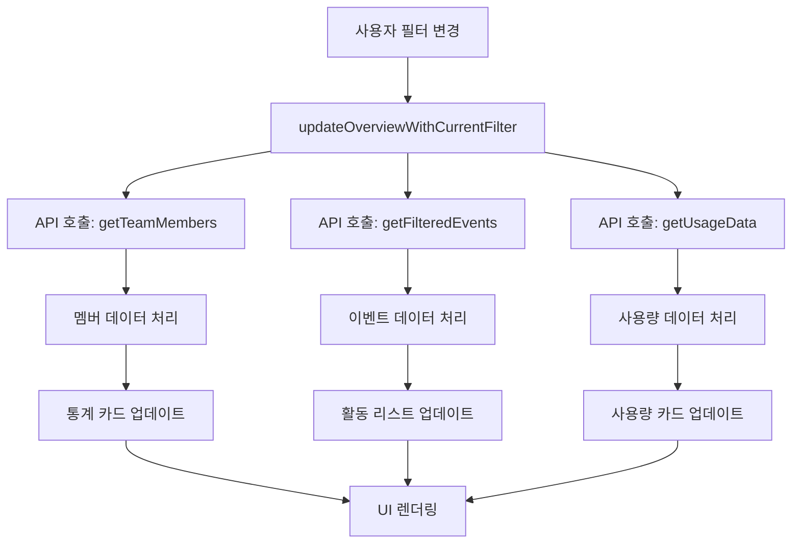
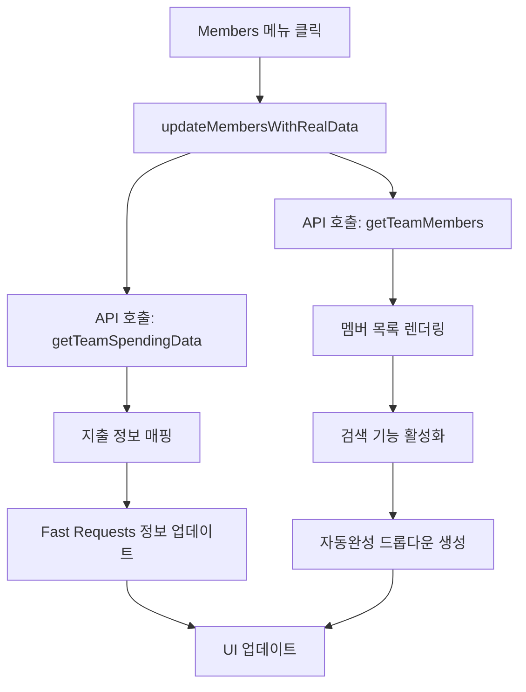
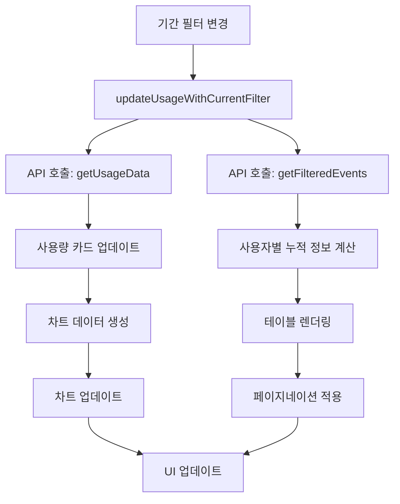

# Samsung AI Experience Group Dashboard 기술 문서

## 📋 목차
1. [시스템 아키텍처](#시스템-아키텍처)
2. [API 구조](#api-구조)
3. [프론트엔드 구성](#프론트엔드-구성)
4. [데이터 플로우](#데이터-플로우)
5. [개발 가이드라인](#개발-가이드라인)
6. [최근 업데이트](#최근-업데이트)
7. [문제 해결](#문제-해결)

## 🏗️ 시스템 아키텍처

### 전체 구조
```
┌─────────────────┐    ┌─────────────────┐    ┌─────────────────┐
│   Frontend      │    │   Proxy Server  │    │  Cursor Admin   │
│   (dash.html)   │◄──►│  (proxy_server  │◄──►│      API        │
│                 │    │      .py)       │    │                 │
└─────────────────┘    └─────────────────┘    └─────────────────┘
        │                       │                       │
        │                       │                       │
        ▼                       ▼                       ▼
   HTML5/CSS3/JS         Flask Server           RESTful API
   Canvas API            CORS Handling         Basic Auth
```

### 포트 설정
- **프록시 서버**: `localhost:8001`
- **대시보드 접속**: `http://localhost:8001/dash.html`
- **API 통신**: `http://localhost:8001` (프록시를 통한 Cursor Admin API)

### 기술 스택
- **프론트엔드**: HTML5, CSS3, Vanilla JavaScript (ES6+)
- **백엔드**: Python Flask (프록시 서버)
- **차트**: Canvas API
- **인증**: Basic Authentication
- **통신**: Fetch API

## 🔌 API 구조

### API 설정
```javascript
const API_CONFIG = {
    baseUrl: 'http://localhost:8001',
    apiKey: 'key_e46368ce482125bbd568b7d55090c657e30e4b73c824f522cbc9ef9b1bf3f0d3',
    headers: {
        'Content-Type': 'application/json'
    }
};
```

### 주요 엔드포인트

#### 1. 팀 멤버 정보
```javascript
// GET /teams/members
async function getTeamMembers() {
    return await callAPI('/teams/members');
}
```

#### 2. 팀 지출 데이터
```javascript
// POST /teams/spend
async function getTeamSpendingData() {
    return await callAPI('/teams/spend', 'POST', {
        page: 1,
        pageSize: 1000
    });
}
```

#### 3. 일별 사용량 데이터
```javascript
// POST /teams/daily-usage-data
async function getUsageData(startDate, endDate) {
    return await callAPI('/teams/daily-usage-data', 'POST', {
        startDate: startDate,
        endDate: endDate
    });
}
```

#### 4. 필터링된 사용량 이벤트
```javascript
// POST /teams/filtered-usage-events
async function getFilteredEvents(startDate, endDate) {
    return await callAPI('/teams/filtered-usage-events', 'POST', {
        startDate: startDate,
        endDate: endDate
    });
}
```

### API 호출 함수
```javascript
async function callAPI(endpoint, method = 'GET', data = null) {
    try {
        const credentials = `${API_CONFIG.apiKey}:`;
        const encodedCredentials = btoa(credentials);
        
        const options = {
            method: method,
            headers: {
                ...API_CONFIG.headers,
                'Authorization': `Basic ${encodedCredentials}`
            }
        };

        if (data && method === 'POST') {
            options.body = JSON.stringify(data);
        }

        console.log(`API call: ${method} ${API_CONFIG.baseUrl}${endpoint}`);
        
        const response = await fetch(API_CONFIG.baseUrl + endpoint, options);
        
        if (!response.ok) {
            throw new Error(`API call failed: ${response.status}`);
        }

        return await response.json();
    } catch (error) {
        console.error('API call error:', error);
        throw error;
    }
}
```

## 🎨 프론트엔드 구성

### Overview 섹션

#### 사용량 개요 카드
```javascript
// 사용량 카드 데이터 구조
const usageCards = {
    totalUsers: 0,        // 실제 활동한 사용자 수
    linesOfEdits: 0,      // 에이전트 편집 라인 수
    tabsAccepted: 0,      // 수락된 탭 수
    chats: 0              // 채팅 요청 수
};
```

#### 개선된 차트 생성
```javascript
function createOverviewChart(chartData) {
    // Canvas API를 사용한 차트 렌더링
    // 데이터 패턴 분석:
    // - 높은 피크: 대규모 프로젝트나 집중 작업 기간
    // - 낮은 구간: 휴가나 주말 기간
    // - 점진적 증가: 지속적인 프로젝트 진행
}
```

#### 활동 리스트 페이지네이션
```javascript
function renderOverviewActivityTableWithPagination(activities) {
    // 페이지네이션 로직
    const itemsPerPage = 10;
    const totalPages = Math.ceil(activities.length / itemsPerPage);
    
    // 페이지별 데이터 분할 및 렌더링
}
```

#### 실시간 새로고침
```javascript
function handleRefreshClick() {
    // 진행률 표시
    const progressBar = document.querySelector('.refresh-progress-bar');
    progressBar.style.width = '0%';
    
    // 백그라운드에서 데이터 업데이트
    updateOverviewWithRealData();
}
```

### Members 섹션

#### 자동완성 검색
```javascript
function updateMembersWithRealData() {
    // API에서 멤버 데이터 가져오기
    const membersData = await getTeamMembers();
    
    // 자동완성 드롭다운 생성
    createAutocompleteDropdown(membersData);
}
```

#### Fast Requests 정보 업데이트
```javascript
function updateFastRequestsResetDate() {
    // Fast Requests 초기화 날짜 표시
    const resetDate = new Date('2025-07-22');
    const today = new Date();
    
    // 날짜 차이 계산 및 표시
}
```

### Usage 섹션

#### 사용량 카드 업데이트
```javascript
function updateUsageCards(usageData, eventsData) {
    // Overview와 Usage 섹션 모두의 카드 업데이트
    const overviewCards = document.querySelectorAll('#overview .usage-card-number');
    const usageCards = document.querySelectorAll('#usage .usage-card-number');
    
    // 실제 활동한 사용자 수 계산
    const activeUsers = new Set();
    eventsData.usageEvents.forEach(event => {
        if (event.userEmail && event.requestsCosts > 0) {
            activeUsers.add(event.userEmail);
        }
    });
    
    // 집계 계산 및 카드 업데이트
}
```

#### 사용자별 누적 사용량 테이블
```javascript
function renderUserCumulativeTableWithPagination(userInfos, startDate, endDate) {
    // 페이지네이션 로직
    const itemsPerPage = currentUserCumulativePageSize;
    const totalPages = Math.ceil(userInfos.length / itemsPerPage);
    
    // 테이블 헤더 업데이트
    // 페이지별 데이터 렌더링
}
```

### Settings 섹션

#### 시스템 상태 모니터링
```javascript
function updateSystemStatus() {
    // API 연결 상태 확인
    // 프록시 서버 상태 확인
    // 데이터 새로고침 기능
}
```

## 🔄 데이터 플로우

### Overview 섹션 데이터 플로우


### Members 섹션 데이터 플로우


### Usage 섹션 데이터 플로우


## 🛠️ 개발 가이드라인

### 코드 구조

#### 전역 상태 관리
```javascript
// 현재 필터 상태
let currentFilterType = 'total';
let currentDateRange = null;
let currentUsageDateRange = null;

// 현재 데이터 상태
let currentActivities = [];
let currentMembers = [];
let currentRawEventsData = [];

// 페이지네이션 상태
let currentRawEventsPage = 1;
let currentRawEventsPageSize = 10;
let currentActivityPage = 1;
let currentActivityPageSize = 10;
let currentUserCumulativePage = 1;
let currentUserCumulativePageSize = 10;

// 로딩 상태
let isOverviewLoading = false;
let isUsageLoading = false;
let isMembersLoading = false;
```

#### 함수 명명 규칙
```javascript
// 동사 + 명사 형식
function updateStatsCards() { }
function renderMemberList() { }
function filterActivitiesByType() { }
function applyDateFilter() { }

// 이벤트 핸들러는 'handle' 접두사 사용
function handleMenuClick() { }
function handleFilterChange() { }

// 비동기 함수는 'async' 키워드 사용
async function fetchTeamMembers() { }
async function updateWithRealData() { }
```

#### 에러 처리 패턴
```javascript
async function updateWithRealData() {
    try {
        console.log('=== 데이터 업데이트 시작 ===');
        const data = await fetchData();
        updateUI(data);
        console.log('=== 데이터 업데이트 완료 ===');
    } catch (error) {
        console.error('❌ 데이터 업데이트 실패:', error);
        showErrorMessage(error.message);
    }
}
```

### 성능 최적화

#### 디바운싱
```javascript
function debounce(func, wait) {
    let timeout;
    return function executedFunction(...args) {
        const later = () => {
            clearTimeout(timeout);
            func(...args);
        };
        clearTimeout(timeout);
        timeout = setTimeout(later, wait);
    };
}

const debouncedSearch = debounce(filterMembers, 300);
```

#### 캐싱
```javascript
const DataCache = {
    members: null,
    spending: null,
    events: null,
    
    set(key, data) {
        this[key] = {
            data: data,
            timestamp: Date.now()
        };
    },
    
    get(key) {
        const cached = this[key];
        if (cached && Date.now() - cached.timestamp < 5 * 60 * 1000) {
            return cached.data;
        }
        return null;
    }
};
```

#### 프로그레시브 로딩
```javascript
async function progressiveLoad() {
    // 1단계: 기본 UI 표시
    showSkeletonUI();
    
    // 2단계: 캐시된 데이터 표시
    const cachedData = DataCache.get('members');
    if (cachedData) {
        updateUIWithData(cachedData);
    }
    
    // 3단계: 최신 데이터 로드
    const freshData = await fetchLatestData();
    updateUIWithData(freshData);
}
```

## 📊 최근 업데이트

### 2025-08-03

#### Overview 섹션 개선
- **사용량 개요 카드**: Total Users, Lines of Agent Edits, Tabs Accepted, Chats 표시
- **활동 리스트 페이지네이션**: 한 페이지당 10개 항목으로 제한
- **실시간 새로고침**: 헤더의 새로고침 버튼으로 즉시 데이터 업데이트
- **정확한 기간 필터링**: 사용량 카드가 Overview 필터 기간을 정확히 반영

#### Members 섹션 개선
- **자동완성 검색**: 이메일 입력 시 자동완성 드롭다운 표시
- **Fast Requests 정보**: Reset Date 및 사용 횟수 상세 표시
- **실시간 데이터**: API를 통한 실시간 멤버 정보 업데이트

#### Usage 섹션 개선
- **페이지네이션**: 사용자별 누적 사용량 테이블에 페이지네이션 추가
- **향상된 UX**: 더 나은 사용자 경험과 성능 최적화

#### 성능 최적화
- **프로그레시브 로딩**: 단계별 데이터 로딩으로 빠른 초기 로드
- **백그라운드 업데이트**: 사용자 경험을 방해하지 않는 데이터 업데이트
- **디바운싱**: 검색 입력 최적화로 성능 향상

#### API 포트 변경
- **프록시 서버 포트**: 8000 → 8001로 변경
- **대시보드 접속 URL**: `http://localhost:8001/dash.html`
- **API 통신**: 모든 API 호출이 포트 8001을 통해 이루어짐

### 이전 업데이트 (2025-08-02)

#### Overview 섹션 개선
- **사용량 개요 카드**: Total Users, Lines of Agent Edits, Tabs Accepted, Chats 표시
- **활동 리스트 페이지네이션**: 한 페이지당 10개 항목으로 제한
- **실시간 새로고침**: 헤더의 새로고침 버튼으로 즉시 데이터 업데이트

#### Members 섹션 개선
- **자동완성 검색**: 이메일 입력 시 자동완성 드롭다운 표시
- **Fast Requests 정보**: Reset Date 및 사용 횟수 상세 표시
- **실시간 데이터**: API를 통한 실시간 멤버 정보 업데이트

#### Usage 섹션 개선
- **페이지네이션**: 사용자별 누적 사용량 테이블에 페이지네이션 추가
- **향상된 UX**: 더 나은 사용자 경험과 성능 최적화

## 🔧 문제 해결

### 일반적인 문제

#### API 연결 오류
```javascript
// 문제: API 호출 실패
// 해결: 프록시 서버 포트 확인
const API_CONFIG = {
    baseUrl: 'http://localhost:8001', // 포트 8001 확인
    apiKey: 'key_...',
    headers: { 'Content-Type': 'application/json' }
};
```

#### CORS 오류
```python
# proxy_server.py에서 CORS 처리
class CursorAPIProxy(BaseHTTPRequestHandler):
    def end_headers(self):
        self.send_header('Access-Control-Allow-Origin', '*')
        self.send_header('Access-Control-Allow-Methods', 'GET, POST, OPTIONS')
        self.send_header('Access-Control-Allow-Headers', 'Content-Type, Authorization')
        super().end_headers()
```

#### 데이터 로딩 실패
```javascript
// 문제: 데이터가 표시되지 않음
// 해결: 에러 처리 및 재시도 로직
async function fetchDataWithRetry(maxRetries = 3) {
    for (let i = 0; i < maxRetries; i++) {
        try {
            return await fetchData();
        } catch (error) {
            console.error(`시도 ${i + 1} 실패:`, error);
            if (i === maxRetries - 1) throw error;
            await new Promise(resolve => setTimeout(resolve, 1000 * (i + 1)));
        }
    }
}
```

### 성능 문제

#### 느린 로딩 속도
```javascript
// 해결: 프로그레시브 로딩 구현
async function progressiveLoad() {
    // 1. 스켈레톤 UI 표시
    showSkeletonUI();
    
    // 2. 캐시된 데이터 표시
    const cachedData = DataCache.get('members');
    if (cachedData) {
        updateUIWithData(cachedData);
    }
    
    // 3. 최신 데이터 로드
    const freshData = await fetchLatestData();
    updateUIWithData(freshData);
}
```

#### 메모리 사용량 최적화
```javascript
// 해결: 데이터 정리 및 캐시 관리
function cleanupData() {
    // 오래된 캐시 데이터 정리
    Object.keys(DataCache).forEach(key => {
        const cached = DataCache[key];
        if (cached && Date.now() - cached.timestamp > 10 * 60 * 1000) {
            DataCache[key] = null;
        }
    });
}

// 주기적으로 실행
setInterval(cleanupData, 5 * 60 * 1000);
```

### 포트 설정 문제 해결

#### 포트 불일치 문제
```javascript
// 문제: 프록시 서버와 대시보드 포트 불일치
// 해결: 모든 포트를 8001로 통일

// 1. proxy_server.py 확인
def run_proxy_server(port=8001):  // 포트 8001로 설정

// 2. dash.html API_CONFIG 확인
const API_CONFIG = {
    baseUrl: 'http://localhost:8001',  // 포트 8001로 설정
    // ...
};

// 3. 브라우저 접속 URL 확인
// http://localhost:8001/dash.html
```

### 디버깅 도구

#### 콘솔 로깅
```javascript
// 함수 시작/종료 로깅
console.log('=== 함수명 시작 ===');
console.log('=== 함수명 완료 ===');

// 데이터 로깅
console.log('📊 데이터:', data);
console.log(`✅ ${count}개 처리됨`);

// 오류 로깅
console.error('❌ 오류 발생:', error);
```

#### 성능 모니터링
```javascript
const PerformanceMonitor = {
    timers: {},
    
    start(label) {
        this.timers[label] = Date.now();
        console.log(`⏱️ ${label} 시작`);
    },
    
    end(label) {
        const duration = Date.now() - this.timers[label];
        console.log(`⏱️ ${label} 완료: ${duration}ms`);
        return duration;
    }
};
```

---

*마지막 업데이트: 2025-08-03* 